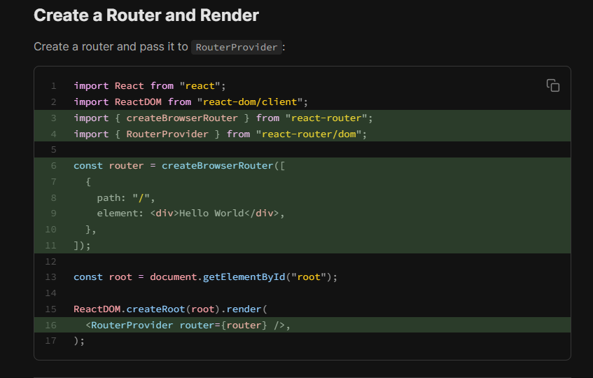

## INSTRUCTION OF DEPLOY WEBSITE ON SURGE (DONT USE POWERSHALL 💣✂)   
- DOWNLOAD SURGE :
### 1st way :  
` npm install --global surge  `
` cd dist `
` surge `

### 2nd way : 
- First install surge, if you haven’t already : ` npm install --global surge  `
- Run ` npm run build`.
- Deploy to surge by typing ` surge dist `.
- You can also deploy to a custom domain by adding surge dist yourdomain.com.
- custom domain create process : 
    - create a folder in public folder and name it : `CNAME` , put the url : ` sihambintahabib-assairment.surge.sh ` 


Visit the website for more information : 
` https://vite.dev/guide/static-deploy.html#surge:~:text=firebase%20deploy.-,Surge,to%20a%20custom%20domain%20by%20adding%20surge%20dist%20yourdomain.com.,-Azure%20Static%20Web `

## INSTRUCTION OF VITE FOR REACT    
### 1st process : 
- Download vite for react: ` npm create vite@latest my-react-project -- --template react `
- Type for conformation : `y` 
- ` cd my-project `
- ` npm install `
- ` npm run dev`
-  Local:   http://localhost:5173/
- Press ctrl+c to stop the live server
- press `y then enter` to conform

### 2nd process : 
- type : `npm create vite@latest`
- choose filename : `my-project`
-  choose language :  `javascript `
- npm install :  
- ` cd my-project `
- ` npm install `
- ` npm run dev`    

## INSTRUCTION OF Install Tailwind
- Install Tailwind CSS :  ` npm install tailwindcss @tailwindcss/vite `
- Configure the Vite plugin into `vite.config.js file`  :   ` import tailwindcss from '@tailwindcss/vite' `
- add this pluging to vite.config.js into pluging :  ` tailwindcss() `
- file import in index.css : ` @import "tailwindcss"; `
- Visit the website for more information : 
` https://tailwindcss.com/docs/installation/using-vite `


## INSTRUCTION OF Install daisy   
 - download : ` npm i -D daisyui@latest `
 - file import in index.css : ` @plugin "daisyui"; `

## INSTRUCTION OF Install Toastify   
- download : `npm i react-toastify@11.0.0-0`
- import into app.jsx :  ` import { ToastContainer, toast } from 'react-toastify'; `
- import into app.jsx :  ` import { ToastContainer, toast } from 'react-toastify'; `
- Place the ` <ToastContainer /> `  component at the root level of your application (e.g., inside your App.JSX component's return statement) where you want the toasts to appear.
- ADD THE ALERT : ` toast ('YOUR COMMENT') ` ALSO IMPORT THE toast from the react ` import { toast) from "react-toastify"; `

- Visit the website for more information : 
` https://www.npmjs.com/package/react-toastify/v/11.0.0-0 `


## INSTRUCTION OF Install React-router   
- Downoad : ` npm i react-router `
- Create ROUTER and RENDER : add these code into ` main.jsx `
``` 
import React from "react";
import ReactDOM from "react-dom/client";

 import { createBrowserRouter } from "react-router";
import { RouterProvider } from "react-router/dom"; 


const router = createBrowserRouter([
  {
    path: "/",
    element: <div>Hello World</div>,
  },
]);

const root = document.getElementById("root");

ReactDOM.createRoot(root).render(
  <RouterProvider router={router} />,
);
```


- 


---
problem : 
1. daisy ui 
2.how to learn react 
3. props
4. use 
5. usestate