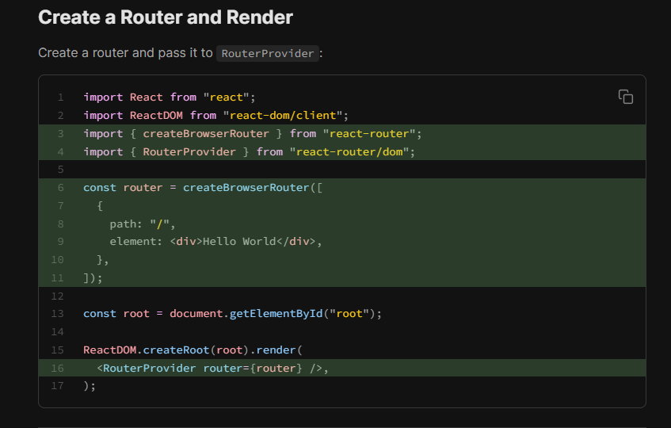

## INSTRUCTION OF Install React-router   
- Downoad : ` npm i react-router `
- Create ROUTER and RENDER : add these code into ` main.jsx `
``` 
import React from "react";
import ReactDOM from "react-dom/client";

 import { createBrowserRouter } from "react-router";
import { RouterProvider } from "react-router/dom"; 


const router = createBrowserRouter([
  {
    path: "/",
    element: <div>Hello World</div>,
  },
]);

const root = document.getElementById("root");

ReactDOM.createRoot(root).render(
  <RouterProvider router={router} />,
);
```


- 


---
## CREATE DIFFERENT PATH : 
 CREATE `createBrowserRouter ([ array of path ])` FUNCTION : <br>
 ```
const router = createBrowserRouter([
  {
    path: "/",
    element: <div>Hello World</div>,
  },
]); 
```